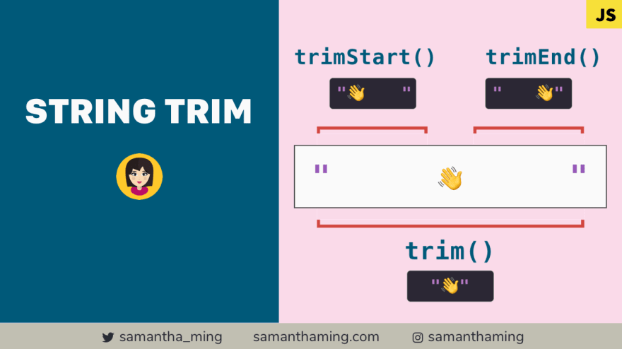
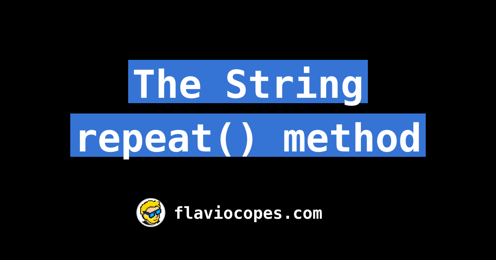

# WHAT IS A METHOD IN JS?
A method is a group of code which runs when we call it! . We can
put parameters into a method . They are also known as functions.

# CREATE JS STRINGS
> There is 3 ways to create string:

    1 . "Double Quotes"
    2 . "Single Quotes"
    3 . "Backticks"
### JAVA SCRIPT STRING METHODS:
> charAt() , concat(a, b, ...) , includes() , indexOf() , repeat() , replace() , replaceAll() , search() , slice() , split() , substr() , substring() , toLowerCase() , toUpperCase() , toString() , trim() .  

### JavaScript method charAt()
The charAt() method returns character's position in string
> let text = "Hello World"
let letter = text.charAt(0);
console.log(letter);
Answer : character with 0 position is "H" so answer is "H".
### JavaScript method concat()
The concat() method joins two or more strings.
> let text1 = "Hello"
  let text2 = "World"
let result = text.concat(" ", text2);
console.log(result);
Answer : Hello World.

### JavaScript method replace()
The replace() method  searching for value or regular exprassion.
The replace() method returs new string with new value replaced
The replace() method does not changes the original string
> let text = "Hello World"
let result = text.replace("World", "Hello");
console.log(result);
Answer : Hello Hello.

### JavaScript method replaceAll()
The replaceAll() method returns a new string with all matches of a patter replaced by a replacement . 
> let text = "Hello World Hello World Hello World Hello World "
let result = text.replaceAll("World", "Hello");
console.log(result);
Answer : Hello Hello Hello Hello Hello Hello Hello Hello 

### JavaScript method split()
The split() method splits a string into an array of substrings.
We can input our parameters into split:no parameter( ) ,  ("") one parameter , (" " any num) 2 parameter .

### JavaScript method substr(start, length)
The substr() method that take a part of string .
The substr() method start at a specified position , and returns specified number of characters.
The substr() method does not changes the original string.
To take characters from the end of the string , use a negative start position.
> let text = "Hello World"
let result = text.substr(1, 8);
console.log(result);
Answer : ello wor.

> let text = "Hello World"
let result = text.substr(-6, 6);
console.log(result);
Answer : world!.

### JavaScript method substring(start, end)
The substring() method take characters, between two indices(position) from a string and returns the substring .
The substring() method takes characters form begining till the end(exclusive) .
The substring() method does not changes the original string.
If value if less than zero then, we take from beginning to the end. 
> let text = "Hello World!"
let result = text.substring(2);
console.log(result);
Answer : llo world!.

> let text = "Hello World!"
let result = text.substring(-3);
console.log(result);
Answer : Hello World! 

> let text = "Hello World!"
let result = text.substring(text.length-1);
console.log(result);
Answer : ! 

### JavaScript method slice(start, end)
The substring() method copies position of array to a new array from start to the end.Represent the index of items in array .
> let text = "Hello World!"
let result = text.slice(0, 5);
console.log(result);
Answer : Hello.

> let text = "Hello World!"
let result = text.slice(3);
console.log(result);
Answer : lo World! 

> let text = "Hello World!"
let result = text.slice(0)
console.log(result);
Answer : Hello World! 

### JavaScript method toLowerCase()
The toLowerCase() method converts string into lowercase letters.
The toLowerCase() method does not changes the original string.
> let text = "Hello World!"
let result = text.toLowerCase()
console.log(result);
Answer : hello world! 

### JavaScript method toUpperase()
The toUpperrCase() method converts string into uppercase letters.
The toUpperCase() method does not changes the original string.
> let text = "Hello World!"
let result = text.toUpperCase()
console.log(result);
Answer : HELLO WORLD! 

### JavaScript method trim()
The trim() method removes whitespace from both sides of a string.
The trim() method does not changes the original string.
> let text = "        Hello World!        "
let result = text.trim()
console.log(result);
Answer : hello world! 

### JavaScript method includes()
The includes() method returns true if a string contains a specified string .
Otherwise it returns false .
The includes() method is case sensitive .
> let text = "Hello World!"
let result = text.includes("World!")
console.log(result);
Answer : true

> let text = "Hello World!"
let result = text.includes("World!" 6)
console.log(result);
Answer : true 

### JavaScript method search()
The search() method matches string against a regular expression.
The search() .method returns the position of the first match .
The search() method returns -1, if no match found.
> let text = "Hello World!"
let result = text.search("World!")
console.log(result);
Answer : 6
### JavaScript method toString()
The toString() method returns a string representing object.
By default toString() takes no parameters.
> let a = 99
console.log(typeof(a))
let n  = a.toString();
console.log(typeof(n));

> Answer1 : number 
Answer2 : string

### JavaScript method indexOf()
The indexOf() method returns the position of the first occurrence of a value in string.
The indexOf() method returns -1, if the value is not found .
The indexOf() method is case sensitive .
> let text = "Hello World!"
let result = text.indexOf("World!")
console.log(result);
Answer : 6

### JavaScript method repeat()
The repeat() method creates a new string by repeating the given string a specified number of times and returns it.
> let text = "Hello World!"
let result = text.repeat(3)
console.log(result);
Answer : Hello World!Hello World!Hello World! 

### JAVA SCRIPT NUMBER METHODS:
> Math.floor() , Math.ceil() , Math.round() , Math.max() , Math.max() , Math.min() , Math.pow() , Math.sqrt() , Math.abs() , Math.random() , isNaN() .

### JAVA SCRIPT NUMBER METHODS: Math.floor(), ceil(), round()
1 . The floor function rounds down a number to the smallest integer.
> let number = 38.8;
let roundednumber = Math.floor(number)
console.log(roundednumber).
Answer : 38 

2 . The round function rounds returns number rounded to the nearest integer.
> let number = 3.87;
let roundednumber = Math.round(number)
console.log(roundednumber).
Answer : 4

3 . The ceil function rounds up a number to the largest integer.
> let number = 4.3;
let roundednumber = Math.ceil(number)
console.log(roundednumber).
Answer : 5

### JAVA SCRIPT NUMBER METHODS: Math.max(), Math.min()
1 . The max() method finds the maximum value among the specified values and returns it.
> let number = Math.max(12, 4, 5, 9, 0, -3);
console.log(number).
Answer : 12

2 . The min() method finds the minimum value among the specified values and returns it.
> let number = Math.min(12, 4, 5, 9, 0, -3);
console.log(number).
Answer : -3

### JAVA SCRIPT NUMBER METHODS: Math.pow(), Math.sqrt()
1 . The pow() method computers the power of a number by raising the second argument to the power of the first argumnet .
> let number = Math.pow(5, 2);
console.log(number).
Answer : 25

2 . The sqrt() method comouters the square root of a specified number and returns it . 
> let number = Math.sqrt(4);
console.log(number).
Answer : 2

### JAVA SCRIPT NUMBER METHODS: Math.abs, Math.random()
1 . The abs() method finds the absolute value of the number and returns it .
> let number = Math.abs(-2);
console.log(number).
Answer : 2

2 . The random() method function returns a floating-point, pseudo-random number between 0(inclusive) and 1(exclusive).
> let number = Math.random()*10
console.log(number).
Answer : 5

### JAVA SCRIPT NUMBER METHODS: isNaN()
The isNaN() function checks if a value is NaN(Not-a-Number)or not.
> let number = NaN
let number2 = 1
let result1 = isNaN(number)
let result2 = isNaN(number2)
console.log(result1).
console.log(result2).
Answer : true
Answer : false
